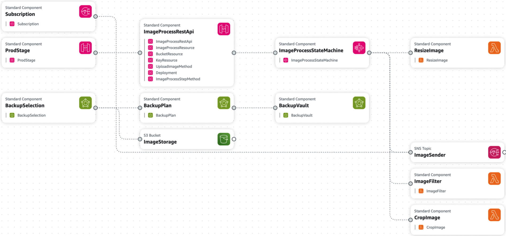

# Serverless Image Processor
The project aims to develop a robust image processing service using a serverless architecture hosted on the AWS cloud plaCorm. This service allows users to upload images, apply various transformaIons (such as resizing, applying filters), and retrieve the processed images. The primary goal is to provide users with a seamless and efficient soluIon for image manipulaIon tasks while leveraging the scalability, flexibility, and cost-effecIveness offered by cloud compuIng technologies.
The target audience for this image processing service includes:
- Photographers and graphic designers requiring quick and efficient image manipulation tools. 
- Businesses needing to automate image processing tasks for their applicaIons, such as e-commerce plaCorms, social media plaCorms, and content management systems.
-  Developers seeking to integrate image processing capabilities into their applications via APIs. 

Services that I chose to implement and their alternatives.

1. **AWS Lambda Functions for Image Processing:**
	**Alternative Consideration:** Deploying the site on EC2 instance was one of the alternatives but that defeats the purpose of going serverless. The Lambda function aligns well with the project's goal of providing a cost-effective and scalable solution for image processing tasks.
	**Reason for Choice:** Lambda functions provide a convenient way to execute code in response to events, such as image uploads, with minimal overhead. They offer seamless integration with other AWS services, enabling efficient processing of images while optimizing costs by only paying for compute time consumed.
2. **AWS Step Functions for Workflow Orchestration:**
	**Alternative Consideration:** AWS Glue could have been considered for orchestrating the image processing workflow, particularly if complex data transformations were required.
	**Reason for Choice:** Step Functions provide a graphical interface for designing and managing workflows, making it easier to define the sequence of image processing tasks and manage the flow of data between Lambda functions. Additionally, Step Functions offer built-in error handling and retry mechanisms, ensuring robustness and reliability in the image processing pipeline.
3. **AWS API Gateway for REST APIs:**
	**Alternative Consideration:** AWS App Runner could have been explored for deploying and managing containerized applications with auto-scaling capabilities.
	**Reason for Choice:** API Gateway simplifies the process of creating and deploying REST APIs, allowing users to interact with the image processing service seamlessly through standardized HTTP endpoints

4. **AWS S3 for Storing Images:**
	**Alternative Consideration:** Amazon EFS (Elastic File System) could have been considered for file storage, especially if a shared file system with support for concurrent access across multiple compute instances was needed.
	**Reason for Choice:** S3 offers a highly durable and scalable storage solution with features such as versioning, encryption, and lifecycle policies, making it suitable for storing both original and processed images securely. Its integration with other AWS services simplifies data management and access control in the image processing pipeline.

5. **AWS SNS for Error Notifications:**
	**Alternative Consideration:** AWS CloudWatch Alarms could have been considered for monitoring and alerting on errors or anomalies in the image processing pipeline. However, SNS was chosen for its flexibility in sending notifications via multiple channels, including email, SMS, and mobile push notifications.
	**Reason for Choice:** SNS allows developers to receive timely notifications about errors or failures in the image processing workflow, enabling them to quickly identify and troubleshoot issues. Its integration with other AWS services, such as Lambda functions, makes it easy to set up automated responses to critical events in the system.

6. **AWS Backup for Data Backup:**
	**Alternative Consideration:** AWS Storage Gateway could have been explored for backing up data to on-premises storage or hybrid cloud environments.
	**Reason for Choice:** AWS Backup simplifies the process of creating and managing backups for S3 data, offering features such as policy-based backup scheduling, cross-region replication, and data lifecycle management.

## Deployment Model I Used

The chosen deployment model for the image processing service is on the public cloud, specifically. In this model, all components of the application, including infrastructure, platforms, and services, are hosted and managed by AWS, accessible over the internet. The decision to deploy the image processing service on the public cloud, specifically AWS, was driven by its scalability, cost-effectiveness, global reach, managed services, security, and flexibility. This deployment model provides the necessary infrastructure and resources to build, deploy, and operate the service efficiently while ensuring high availability, performance, and security for users.

## Delivery Model I Used

The chosen delivery model for the image processing service is Function as a Service (FaaS), where individual functions or units of code are deployed and executed in a serverless environment. In this model, developers focus on writing discrete pieces of code (functions) to perform specific tasks, which are then triggered by events or requests, and the underlying infrastructure automatically scales to handle the workload which is what I have done in my application. The decision to adopt the Function as a Service (FaaS) delivery model for the image processing service was driven by its scalability, cost-effectiveness, simplicity, alignment with microservices architecture, event-driven nature, and built-in resilience. This delivery model enables the image processing service to deliver high-performance, reliable, and cost-efficient image processing capabilities to users in a serverless environment.

## Final Architecture

In our architecture, the cloud mechanisms are integrated as follows:

**AWS Lambda Functions:** Used for image processing tasks, triggered by events such as image uploads.
**AWS Step Functions:** Orchestrates the workflow by coordinating the sequence of Lambda function invocations.
**AWS API Gateway:** Provides RESTful APIs for users to interact with the image processing service.
**AWS S3:** Stores both the original and processed images securely.
**AWS SNS:** Sends notifications to developers in case of errors or failures in the system.
**AWS Backup:** Manages backups for data stored in S3, ensuring data resilience and compliance.

Data, including original and processed images, is stored in Amazon S3 buckets. S3 offers highly durable and scalable object storage, ensuring the availability and integrity of the stored data. Additionally, AWS Backup is utilized to manage backups for data stored in S3, providing an additional layer of data protection.

The Lambda functions are implemented using Python 3.12. Python was chosen for its simplicity, readability, and extensive ecosystem of libraries and frameworks, making it well-suited for rapid development of serverless applications. Python's support for asynchronous programming also facilitates efficient handling of image processing tasks in a scalable and event-driven architecture.

Our architecture aligns closely with the "Dynamic Scalability Architecture" and "Workload Distribution Architecture" taught in the course.

**Dynamic Scalability Architecture:** AWS Lambda and Step Functions enable dynamic scalability by automatically scaling resources up or down based on incoming events or requests. This allows the image processing service to handle varying workloads efficiently without manual intervention, ensuring optimal performance and responsiveness.
**Workload Distribution Architecture:** AWS API Gateway distributes incoming requests from users to the appropriate Lambda functions for processing. This architecture ensures that image processing tasks are evenly distributed across multiple function instances, maximizing throughput and resource utilization.  

## **Data Security in Application Architecture:**

My application architecture implements some measures to ensure data security at all layers.

**Encryption at Rest and in Transit:** All data stored in Amazon S3 buckets is encrypted at rest using server-side encryption (SSE). Additionally, data transferred between clients and the application, as well as between services within the AWS ecosystem, is encrypted in transit using HTTPS protocols.
**Access Control:** Access to S3 buckets and other AWS services is restricted using AWS Identity and Access Management (IAM). IAM policies are defined to enforce the principle of least privilege, ensuring that only authorized users or services have access to the data they need to perform their tasks.
**Data Integrity Verification:** AWS S3 provides built-in checksums to verify the integrity of data stored in buckets. This helps detect and prevent unauthorized modifications or tampering of data.
**Backup and Disaster Recovery:** AWS Backup is utilized to create and manage backups for data stored in S3 buckets. Regular backups help ensure data resilience and facilitate recovery in the event of accidental deletion, corruption, or data loss.

### Vulnerabilities
- Implement data encryption at the application layer using techniques such as client-side encryption before uploading images to S3.

# Private Cloud Cost

Creating a detailed analysis for reproducing our application architecture in a private cloud environment involves estimating the costs associated with hardware, software, and ongoing operational expenses. Let's break down the analysis into these components:

### Hardware Costs:

**Servers:** Depending on the workload and redundancy requirements, let's estimate the cost of each physical server to be around $5,000 to $10,000.

For redundancy and fault tolerance, let's assume we need at least 4 servers, bringing the total cost to $20,000 to $40,000.

**Storage:** Storage arrays or NAS devices can vary significantly in price depending on capacity and performance requirements. Let's estimate the cost of storage to be around $10,000 to $20,000.

Additional costs may include redundant storage for data durability, adding another $5,000 to $10,000.

**Networking Equipment:** Networking equipment costs can vary based on capacity and features. Let's estimate the cost of switches, routers, and other networking gear to be around $10,000 to $20,000.

#### Total Hardware Costs:
Total estimated hardware costs range from approximately $45,000 to $90,000.

## Software Costs:

**Virtualization Software:** Licensing costs for virtualization software such as VMware vSphere or Microsoft Hyper-V can vary based on the number of hosts and features required. Let's estimate the cost to be around $10,000 to $20,000.

**Containerization Platform:** Containerization platforms like Docker or Kubernetes are typically open-source, but there may be costs associated with enterprise support or management tools. Let's estimate the cost to be around $5,000 to $10,000.

**Middleware:** Middleware components may require licenses or subscriptions. Let's estimate the cost to be around $5,000 to $10,000.

**Backup and Disaster Recovery Software:**

Backup and disaster recovery software costs can vary based on features and capacity. Let's estimate the cost to be around $5,000 to $10,000.

**Monitoring and Logging Tools:**

Costs for monitoring and logging tools can vary based on features and scalability. Let's estimate the cost to be around $5,000 to $10,000.

#### Total Software Costs:
Total estimated software costs range from approximately $30,000 to $60,000.

## Operational Expenses:

**Maintenance and Support:** Ongoing maintenance and support costs for hardware and software should be considered. Let's estimate this to be around 20% of the total hardware and software costs annually.

**Total Operational Expenses:** Total estimated operational expenses range from approximately $15,000 to $30,000 annually.

## Grand Total:

Adding up the hardware costs, software costs, and annual operational expenses, the total cost to reproduce our application architecture in a private cloud environment would range from approximately $90,000 to $180,000 for the initial setup, with annual operational expenses of approximately $15,000 to $30,000 thereafter.

# Cloud mechanism that needs monitoring

In our architecture, the cloud mechanism with the most potential to cost the most money and therefore requiring monitoring to prevent unexpected cost escalations is AWS Lambda.

AWS Lambda is a serverless compute service where users are billed based on the number of requests and the duration of code execution. Since Lambda functions are triggered by events, such as image uploads for our image processing service, the costs can escalate if there's a sudden increase in the number of events triggering function invocations.

# Future Enhancements

Here are some potential features and the corresponding cloud mechanisms we might use to implement them:

1. **Advanced Image Processing Techniques**

2. **Real-time Image Processing and Streaming**

3. **Automated Testing and Continuous Integration/Continuous Deployment (CI/CD)**